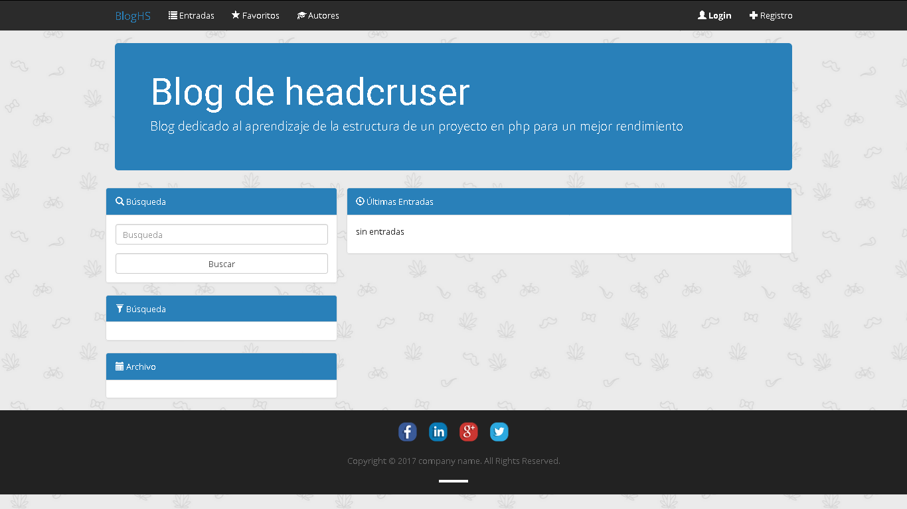
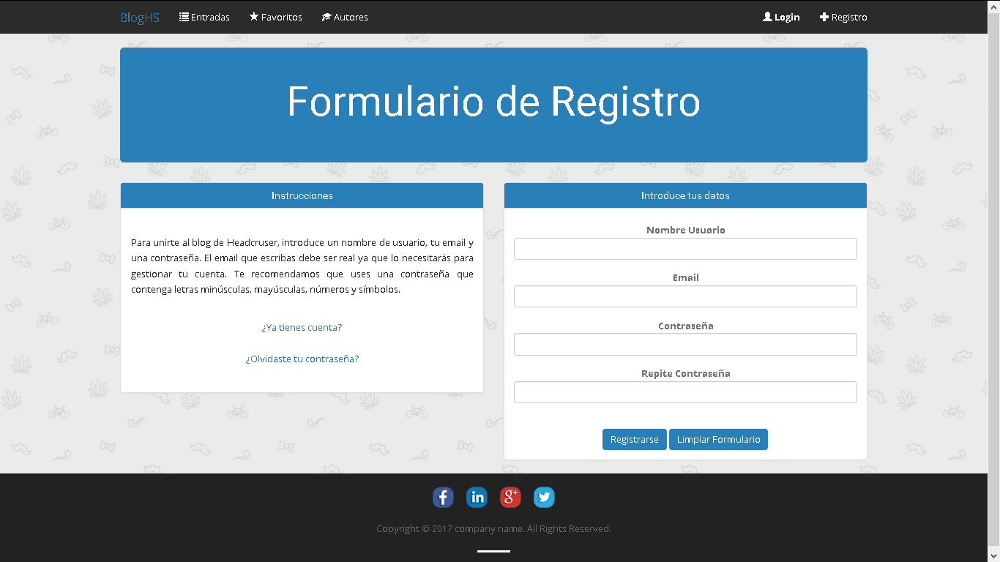
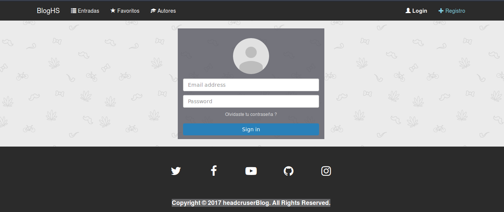

## Estructrura del proyecto
  - **Compiler:** cache generado de las plantillas Smarty
  - **Config:** Almacena el archivo de configuracón de la base de datos
  - **Core:** Contiene la aplicación del sitio web
      *  _Controller:_ Es la carpeta donde se almacenan los controladores de la aplicación
      *  _Exception:_ Contiene las excepciones del sistema.
      *  _Lib:_ Contiene librerias para el funcionamiento del sitio
      *  _Model:_ Contiene los modelo de datos de la aplicación
      *  _ORM:_ Contiene el motor de conexión con la base de datos. 
      *  _sql_ Almacena de manera provicional el sript para hacer uso de la base de datos.
  - **doc:** Documentación del sitio web
  - **Syles:** 
      *  _Css:_ Guarda la cascada de estilos de la aplicación
      *  _Fonts:_ Fuentes utilizadas 
      *  _img:_ Imagenees del sitio
      *  _js:_ Archivos JS
      *  _templates:_ Plantillas utilizadas para la viata
***

## Capturas del sitio
**Index** 

**Registro usuarios**

**Login del sitio**

# INSTALACION
A continuación se ofrecera una explicación, acerca de como se realiza la instalación del proyecto. Antes de comenzar la instalación, se debe aclarar que se debe tener instalado ubuntu o cualquier otra distribucion basada en debian.

Para descargar una copia del proyecto, se necesita descargarlo desde su repositorio en github, el cual se encuentra en el siguiente 
[link](https://github.com/headcruser/blog).

Antes de trabajar con el proyecto, se necesita Composer, para mayor información, puedes acceder a la página oficial de [composer](https://getcomposer.org/).

El archivo mas importante es el **composer.json** el cual contiene la información de todos las librerias adicionales utilizadas para el funcionamiento del proyecto

para instalarlas, se procede a ejecutar el siguiente comando:
~~~
  composer install
~~~

y finalmente esperar a que se instalen las dependencias del proyecto. 

Otro aspecto importante es la base de datos, la cual se encuentra en **core/sql/blog.sql** e importarlo a su gestor de base de datos.

~~~
Script disponible de momento solo para mysql.
~~~

Finalmente si se desea tener mayor información acerca de la estructura del proyecto, puede revisar el [indice](/doc/Indice.md) del contenido. 