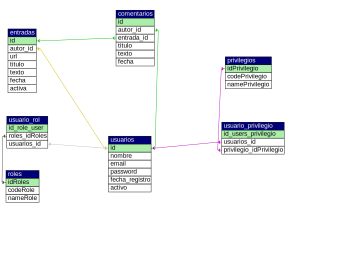

# Sobre este Proyecto
El proyecto tiene la finalidad de crear una página web, dónde de manera ficticia, se trabaje un blog, dónde diversos autores puedan publicar sus articulos de manera sencilla, poder ser leidos por los usuarios que visiten la página.

Al iniciar este proyecto, simplemente fue pensado como un pasatiempo personal, pero conforme fue creciendo el proyecto, simplemente me di cuenta de que se debia estructurar, por lo que me he dado a la tarea de estar actualizando el sitio ficticio, desde documentar de manera adecuada todos los aspectos del codigo, hasta aprender el uso adeuado de herramientas como GitHub y Visual studio Code. De esta manera, puedo obtener experiencia como desarrollador web.

Es cierto que este tipo de trabajo se pudo realizar mediante algún framework(**Cake,Laravel, etc.**), pero opte por intentar generar mi propio código. Sin embargo, no soy tan bueno programando, por lo que me he dado a la tarea de ir refactorizando poco a poco el código,utilizando patrones de diseño, los cuales aprendo y posteriormente aplico al codigo.

  __**Daniel Martinez, Octubre 2017**__

***

## Estructrura del proyecto
  - **Compiler:** Guarda el cache generado de la construccion de plantillas Smarty
  - **Config:** Almacena el archivo de configuracón de la base de datos
  - **Core:** Es el motor de la aplicacón donde se tienen diferentes directorios
      *  _Controller:_ Es la carpeta donde se almacenan los controladores de la aplicación
      *  _Lib:_ Contiene librerias como el sistema de rutas o la generación de las vistas
      *  _help:_ Contiene diversos metodos de utilidad, como validación de campos.
      *  _Model:_ Contiene los modelo de datos de la aplicación
      *  _ORM:_ Contiene el motor de conexión con la base de datos. 
      *  _sql_ Almacena los scripts de la base de datos, asi como ejemplos de uso del código.
  - **Syles:** 
      *  _Css:_ Guarda la cascada de estilos de la aplicación
      *  _Fonts:_ Fuentes utilizadas 
      *  _img:_ Imagenees del sitio
      *  _js:_ Archivos JS
      *  _templates:_ Plantillas utilizadas para la viata

Esta estructura puede variar, dependiendo del estandar implementado por frameworks como Laravel o symfony.
***
## Esquema de la base de datos

A continuación se presenta el diagrama de la base de datos.

El Esquema de base de datos, representa la estructura de datos, en donde se almacenan los siguientes elmementos

- *Entradas:*  Representa los articulos publicados en el sitio
- *Comentarios:* Almacenan los comentatrios de los que leen los blogs 
- *Usuarios:* Representan los usuarios registrados del sistema
- *Roles:* Representan la función que desempeñan dentro del sistema 
- *Privilegios:* Representan los permisos de los usuarios.

***

## Librerias
Las librerias permiten facilitar trabajo en algunos aspectos.Existen diversas Librerias que ayudan a facilitar la construcción de sitios web

**Las librerias que se utilizaron fueron:**
 - Smarty (Gestor de plantillas)
 - Kint ( Depurador para ver arreglos)
 - GUMP ( Validacion de formularios en php)
 - composer (Gestor de dependencias)
 
### Composer
Composer ofrece la posiblidad de gestionar la carga de clases, mediante los namespaces de php, lo cual evita realizar demasados 
includes en el archivo de configuracion. Composer se encarga de incluir todas las dependencias utilizadas para los archivos, por  lo que unicamente, se incluye un archivo de configuracion "autoload".
Al instalar composer, se incluye un archivo Json para indicar que elementos se deben añadir para su posterior carga. 
Para más información: [Ir a composer](https://getcomposer.org/).

### Smarty
Smarty es un motor de plantillas para PHP. Mas especificamente, esta herramienta facilita la manera de separar la aplicación lógica y el contenido en la presentación. La mejor descripción esta en una situación donde la aplicación del programador y la plantilla del diseñador juegan diferentes roles, o en la mayoria de los casos no la misma persona. Para más informacion acerca de este motor de plantillas: [Documentación Smarty](http://www.smarty.net/docsv2/es/what.is.smarty.tpl).

### Kint
Es una herramienta moderna y poderosa para debugear en php. Esta libreria es muy util para poder analizar la estructura de los array de una manera mas clara. [Repositorio en git](https://github.com/kint-php/kint.git).

### GUMP
Es una libreria que facilita el trabajo de validación de los formularios. ademas de tener diversos tipos de validaciones, tambien el usuario puede agregar sus propios tipos de validaciones. [Repositorio en git](https://github.com/Wixel/GUMP.git).

***
## FrontEnd
### Boostrap
Boostrap es un framework frontend, el cual ofrece diversas herramientas para la maquetacion de la página web, ademas de que ofrece un diseño responsive
### Jquery
Esta libreria auque actualmente no es de las mas solicitadas, tiene muchos complementos que permiten una página web mucho mas intetactiva con el usuario. Alguna de las librerias utiizadas en este proyecto en particular fueron 
- [overhang](https://paulkr.github.io/overhang.js/)
- [jquery-Confirm](https://craftpip.github.io/jquery-confirm/)
- [Data Tables](https://datatables.net/)
Actualmente hay otras soluciones como Angular JS, ReactJS,vue.js, pero posiblemente se agregen más adelante 

***

## Arquitectura
En este apartado, se describe el funcionamiento de los diferentes módulos integrados hasta el momento.
   
### MVC.
 Este tipo de arquitecura, nos permite separa la logica de negocio, de la vista del cliente. De esta manera el mantenimieto a largo plazo es mucho mas sencillo, que trabjar sin ningún tipo de esquema. En el caso de esta aplicación se dividen en tres grandes ramas. A continuacion se explica la categoria, junto con la analogia con este diseño aqrquitectonico.  
* _Modelo_ 
  - 'Models': Es una abstración de todos los elementos de la base de datos, mediante el uso de getters y setters mágicos en php
* _Vista_
  - 'Vista': En esta version del proyecto, se utilza un gestor de plantillas. En este caso Smarty cumple con esa función, pero  independientemente del motor de plantillas, estas se encuentran encapsuladas mediante una clase llamada vistas, la cual se encarga de realizar las configuraciones necesarias para mostrarlas al usuario. Por la forma de estar programado, tiene limitaciones en cuanto al numero de variables que se le pueden asignar a la vista, pero se
* *Controlador:*
  - Controllers Se encargan de manejar las interacciones entre el sistema y el usuario. En esta clase se definen los metodos que se encargaran de mostrar las vistas.
 