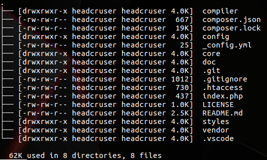

# ESQUEMA DE DISEÑO DE BLOG
Este documento, contiene los objetivos, y metodologia de trabajo de la página en construcción.

## OBJETIVO GENERAL
Diseñar una página web con tematica de blog, con la finalidad de integrar distintas herramientas de desarrollo, tanto en el frot-end, como en el backend. 
***

## REQUERIMIENTOS

**REQ1:** Diseñar la estructura de navegación.
  - Establecer el esquema de colores del sitio
  - Maquetar el diseño básico del sitio.
  - Definir el Mapa de navegacion del sitio

**REQ2:** Modelar la base de datos para almacenar la información de los usuarios.
  - Diseñar Modelo E-R
  - Diseñar Modelo Relacional 
  - Construir el script

**REQ3:** Tarjeta de Articulos 
  - Fecha
  - Titulo 
  - Autor
  - Resumen (150 palabras)

**REQ4:** Establecer un sistema de identificación para que los autores puedan acceder al sistema. 
  - Creación de un login
  - Encriptación de contraseñas 
  - Creación de sesion para el usuario. 

**REQ5:** Registro de usuarios
  - Formulario básico para obtener los datos del usuario 
  - Validar informacion 
  - Verificar que no exista el usuario dentro de la base de  datos 

**REQ6:** Sistema de Perfil
  - Subir una imagen
  - Cambiar nombre
  - cambiar Alias 
  - Cambiar contraseña 

**REQ7:** Gestionar Articulos.
  - Ver articulos 
  - Editar articulos 
  - Eliminar Articulos
  - Ver numero de articulos publicados
***

# (REQ1) ESTRUCTURA
## Estructura de navegación

- *Inicio ( home )*
  - Autores
    - Busquedas Personalizadas
  - Entradas 
    - Busquedas Personalizadas
  - Blog
    - Cometarios de un blog 
    - Cualquiera puede comentar
- *Registro (Usuario)*
  - Formulario de Registro 
  - Recuperación de cuenta
- *Login*
  - Autenticación de usuarios
- *Administrador*
  - CRUD Tablas del sistema 
  - Perfil 
  - Reportes PDF (Opcional en registro de auditorias)
  - Opción Eliminar Datos
- Usuario (Básico Autentificado)
  - Editar Blogs Propios
  - Crear Blogs
  - Publicar Blogs
  - Modificar Perfil
    - Foto
    - Datos Personales

## Estructura de archivos

# (REQ2) DISEÑO DEL MODELO DE DATOS

### Modelo E-R

### Modelo Relacional

El Esquema de base de datos, representa la estructura de datos, en donde se almacenan los siguientes elmementos

- *Entradas:*  Representa los articulos publicados en el sitio
- *Comentarios:* Almacenan los comentatrios de los que leen los blogs 
- *Usuarios:* Representan los usuarios registrados del sistema
- *Roles:* Representan la función que desempeñan dentro del sistema 
- *Privilegios:* Representan los permisos de los usuarios.

***

## Arquitectura
En este apartado, se describe el funcionamiento de los diferentes módulos integrados hasta el momento.
   
### MVC.
 Este tipo de arquitecura, nos permite separa la logica de negocio, de la vista del cliente. De esta manera el mantenimieto a largo plazo es mucho mas sencillo, que trabjar sin ningún tipo de esquema. En el caso de esta aplicación se dividen en tres grandes ramas. A continuacion se explica la categoria, junto con la analogia con este diseño aqrquitectonico.  

* **Modelo** : Es una abstración de todos los elementos de la base de datos, mediante el uso de getters y setters mágicos en php.

* **Vista** : En esta version del proyecto, se utilza un gestor de plantillas. En este caso Smarty cumple con esa función, pero  independientemente del motor de plantillas, estas se encuentran encapsuladas mediante una clase llamada vistas, la cual se encarga de realizar las configuraciones necesarias para mostrarlas al usuario. 

* **Controlador :**  Controllers Se encargan de manejar las interacciones entre el sistema y el usuario. En esta clase se definen los metodos que se encargaran de mostrar las vistas.
